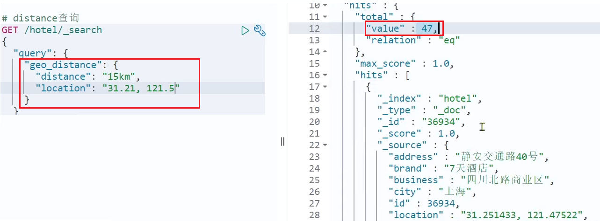
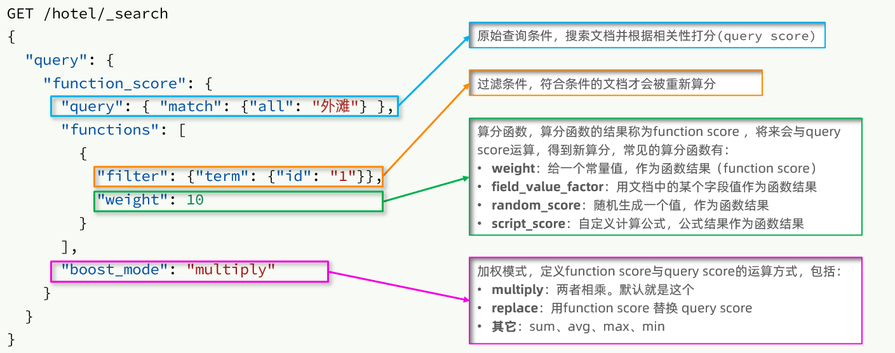
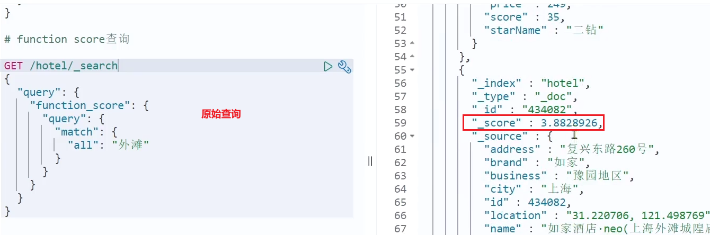
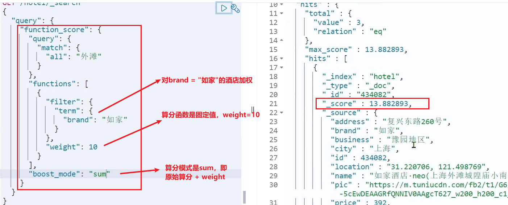
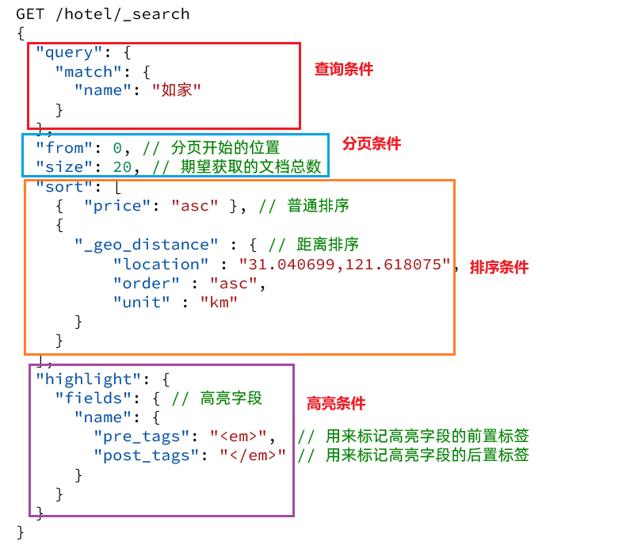
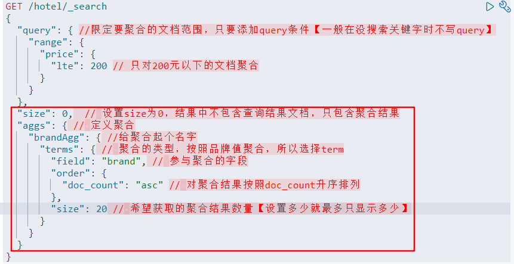

# 搜索

## 1. DSL设置查询条件
1.1 DSL查询分类

        Elasticsearch提供了基于JSON的DSL（Domain Specific Language）来定义查询。常见的查询类型包括：

- 查询所有：查询出所有数据，一般测试用。例如：match_all
- 全文检索（full text）查询：利用分词器对用户输入内容分词，然后去倒排索引库中匹配。例如： 
  - match_query 
  - multi_match_query

- 精确查询：根据精确词条值查找数据，一般是查找keyword、数值、日期、boolean等类型字段。例如： 
  - ids 
  - range 
  - term
- 地理（geo）查询：根据经纬度查询。例如： 
  - geo_distance
  - geo_bounding_box
- 复合（compound）查询：复合查询可以将上述各种查询条件组合起来，合并查询条件。例如：
  - bool
  - function_score

查询语法如下：
```
GET /indexname/_search
{
  "query": {
    "查询类型":{
      "查询条件": "查询值"
    }
  }
}
```

例子：
查询index为user的所有doc，一般用于测试
```bash
GET /user/_search
{
  "query": {
    "match_all":{
    }
  }
}
```

1.2 全文检索查询
match和multi_match的区别是什么？

match：根据一个字段查询【推荐：使用copy_to构造all字段】
multi_match：根据多个字段查询，参与查询字段越多，查询性能越差
注：搜索字段越多，对查询性能影响越大，因此建议采用copy_to，然后单字段查询的方式。

检索all字段，all是所有设置了copy_to字段的合集
```bash
GET /user/_search
{
  "query": {
    "match":{
      "all" : "上海如家"
    }
  }
}
```

检索多个字段，不推荐，字段阅读性能越低
```bash
GET /user/_search
{
  "query": {
    "multi_match":{
      "query" : "上海如家",
      "fields": ["brand","name","nickname"]
    }
  }
}
```

1.3 精确查询
```bash
GET /user/_search
{
  "query": {
    "term":{
      "city" : {"value": "上海"}
    }
  }
}
```

范围查询,查询年龄 18到35
```bash
GET /user/_search
{
  "query": {
    "range":{
      "age" : {
          "gte":18, 
          "lte":35
        }
    }
  }
}
```

1.4 地理位置查询

```bash
GET /user/_search
{
  "query": {
    "geo_distance":{
      {
        "distance" : "15km"
        "location" : "31.21, 21.5"
      }
    }
  }
}
```


1.5 符合查询
复合（compound）查询：复合查询可以将其它简单查询组合起来，实现更复杂的搜索逻辑。常见的有两种：
- fuction score：算分函数查询，可以控制文档相关性算分，控制文档排名
- bool query：布尔查询，利用逻辑关系组合多个其它的查询，实现复杂搜索
```
GET /hotel/_search
{
  "query": {
    "function_score": {           
      "query": { // 原始查询，可以是任意条件
          "bool": {
              "must": [
                  {"term": {"city": "上海" }}
              ],
              "should": [
                  {"term": {"brand": "皇冠假日" }},
                  {"term": {"brand": "华美达" }}
              ],
              "must_not": [
                  { "range": { "price": { "lte": 500 } }}
              ],
              "filter": [
                  { "range": {"score": { "gte": 45 } }}
              ]
          }
      },
      "functions": [ // 算分函数
        {
          "filter": { // 满足的条件，品牌必须是如家【品牌是如家的才加分，这里是加分条件】
            "term": {
              "brand": "如家"
            }
          },
          "weight": 2 // 算分权重为2
        }
      ],
      "boost_mode": "sum" // 加权模式，求和
    }
  }  
}
```

function score的运行流程如下：
- 1）根据原始条件查询搜索文档，并且计算相关性算分，称为原始算分（query score）
- 2）根据过滤条件，过滤文档
- 3）符合过滤条件的文档，基于算分函数运算，得到函数算分（function score）
- 4）将原始算分（query score）和函数算分（function score）基于运算模式做运算，得到最终结果，作为相关性算分



---

测试，在未添加算分函数时，如家得分如下：



添加了算分函数后，如家得分就提升了：




### 2. 设置搜搜结果
查询的DSL是一个大的JSON对象，包含下列属性：
- query：查询条件
- from和size：分页条件
- sort：排序条件
- highlight：高亮条件
- aggs：定义聚合



